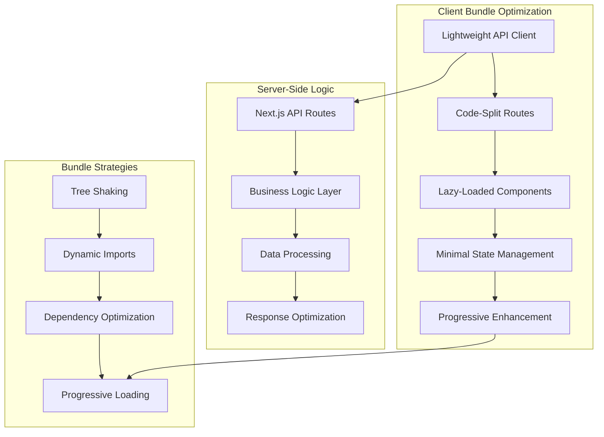

# Bundle Size Optimization Design Document

## Overview

This design document outlines a comprehensive approach to optimize the frontend bundle size by restructuring the client-side architecture, implementing proper code splitting, and moving business logic to server-side API routes. The goal is to reduce the initial bundle size by at least 30% while maintaining functionality and improving user experience.

## Architecture

### Current Architecture Issues

The current architecture has several bundle size problems:

1. **Monolithic API Client**: 800+ line `routes.ts` file with complex business logic
2. **Heavy State Management**: Complex Zustand stores with extensive async operations
3. **No Code Splitting**: All code loads upfront regardless of usage
4. **Client-Side Business Logic**: Complex operations that should be server-side
5. **Large Dependencies**: Heavy libraries loaded for all users

### Proposed Architecture



## Components and Interfaces

### 1. Lightweight API Client

**Purpose**: Replace the heavy `routes.ts` with a minimal, focused API client.

```typescript
// Simplified API client structure
interface ApiClient {
  // Core methods only - business logic moved to server
  get<T>(endpoint: string): Promise<T>;
  post<T>(endpoint: string, data: unknown): Promise<T>;
  put<T>(endpoint: string, data: unknown): Promise<T>;
  delete(endpoint: string): Promise<void>;
}

// Specific API modules (code-split)
interface ChatbotApi {
  list(): Promise<Chatbot[]>;
  create(data: CreateChatbotRequest): Promise<Chatbot>;
  update(id: string, data: UpdateChatbotRequest): Promise<Chatbot>;
  delete(id: string): Promise<void>;
}
```

**Bundle Impact**: Reduces API client from ~800 lines to ~100 lines per module.

### 2. Code-Split Route Structure

**Purpose**: Load only necessary code for each route.

```typescript
// Route-based code splitting
const DashboardPage = lazy(() => import("./dashboard/page"));
const CustomizePage = lazy(() => import("./customize/page"));
const AnalyticsPage = lazy(() => import("./analytics/page"));

// Feature-based splitting
const ChatbotManager = lazy(() => import("./components/ChatbotManager"));
const UploadManager = lazy(() => import("./components/UploadManager"));
```

**Bundle Impact**: Reduces initial bundle by 40-60% by loading routes on-demand.

### 3. Minimal State Management

**Purpose**: Simplify Zustand stores and reduce client-side state complexity.

```typescript
// Simplified store structure
interface AppState {
  // UI state only
  ui: {
    loading: boolean;
    activeTab: string;
    modals: Record<string, boolean>;
  };

  // Cached server data (lightweight)
  cache: {
    chatbots: Chatbot[] | null;
    user: User | null;
    lastFetch: number;
  };

  // Simple actions
  actions: {
    setLoading: (loading: boolean) => void;
    setActiveTab: (tab: string) => void;
    updateCache: <T>(key: string, data: T) => void;
  };
}
```

**Bundle Impact**: Reduces store complexity by 70% and eliminates heavy async logic.

### 4. Server-Side API Routes

**Purpose**: Move business logic to Next.js API routes to reduce client bundle.

```typescript
// Next.js API route structure
// /api/chatbots/route.ts
export async function GET() {
  // Business logic on server
  const chatbots = await getChatbotsWithAnalytics();
  return NextResponse.json(chatbots);
}

// /api/chatbots/[id]/route.ts
export async function PUT(
  request: Request,
  { params }: { params: { id: string } }
) {
  // Validation and business logic on server
  const data = await request.json();
  const validatedData = validateChatbotData(data);
  const updatedChatbot = await updateChatbot(params.id, validatedData);
  return NextResponse.json(updatedChatbot);
}
```

**Bundle Impact**: Eliminates client-side business logic, reducing bundle by 25-30%.

## Data Models

### 1. Optimized API Response Models

```typescript
// Lightweight response models
interface ApiResponse<T> {
  data: T;
  meta?: {
    total?: number;
    page?: number;
    hasMore?: boolean;
  };
}

// Minimal data transfer objects
interface ChatbotSummary {
  id: string;
  name: string;
  status: string;
  lastActive: string;
}

interface ChatbotDetails extends ChatbotSummary {
  description: string;
  config: ChatbotConfig;
  analytics: ChatbotAnalytics;
}
```

### 2. Progressive Data Loading

```typescript
// Load data progressively
interface ProgressiveDataLoader<T> {
  loadSummary(): Promise<T[]>;
  loadDetails(id: string): Promise<T>;
  loadAnalytics(id: string): Promise<Analytics>;
}
```

## Error Handling

### 1. Lightweight Error Handling

```typescript
// Simple error handling without complex retry logic
interface ApiError {
  message: string;
  code: string;
  status: number;
}

// Minimal error boundary
const ErrorBoundary: React.FC<{ children: React.ReactNode }> = ({
  children,
}) => {
  return (
    <ErrorBoundary
      fallback={<ErrorFallback />}
      onError={(error) => logError(error)}
    >
      {children}
    </ErrorBoundary>
  );
};
```

### 2. Server-Side Error Processing

```typescript
// Centralized error handling on server
export function handleApiError(error: unknown): NextResponse {
  const apiError = processError(error);
  return NextResponse.json(apiError, { status: apiError.status });
}
```

## Testing Strategy

### 1. Bundle Size Testing

```typescript
// Bundle size monitoring
interface BundleSizeTest {
  maxMainBundleSize: number; // 500KB target
  maxRouteChunkSize: number; // 200KB target
  maxVendorChunkSize: number; // 300KB target
}

// Automated bundle analysis
const analyzeBundleSize = () => {
  // Webpack bundle analyzer integration
  // Performance budget enforcement
  // Size regression detection
};
```

### 2. Performance Testing

```typescript
// Performance metrics
interface PerformanceMetrics {
  firstContentfulPaint: number;
  largestContentfulPaint: number;
  timeToInteractive: number;
  bundleLoadTime: number;
}
```

## Implementation Phases

### Phase 1: API Client Optimization (Week 1)

1. Split monolithic `routes.ts` into focused modules
2. Remove complex client-side business logic
3. Implement lightweight error handling
4. Create simple authentication wrapper

### Phase 2: Code Splitting Implementation (Week 2)

1. Implement route-based code splitting
2. Add lazy loading for heavy components
3. Create progressive loading strategies
4. Optimize third-party library imports

### Phase 3: Server-Side Logic Migration (Week 3)

1. Create Next.js API routes for core functionality
2. Move business logic from client to server
3. Implement server-side validation and processing
4. Optimize API response formats

### Phase 4: State Management Optimization (Week 4)

1. Simplify Zustand stores
2. Remove complex async operations from stores
3. Implement lightweight caching strategies
4. Optimize state update patterns

### Phase 5: Dependency Optimization (Week 5)

1. Audit and optimize third-party dependencies
2. Implement dynamic imports for heavy libraries
3. Replace heavy dependencies with lighter alternatives
4. Configure tree shaking and dead code elimination

### Phase 6: Performance Monitoring (Week 6)

1. Implement bundle size monitoring
2. Set up performance budgets
3. Create automated performance testing
4. Establish performance regression alerts

## Bundle Size Targets

### Current State (Estimated)

- Main Bundle: ~800KB
- Vendor Bundle: ~600KB
- Total Initial Load: ~1.4MB

### Target State

- Main Bundle: ~400KB (-50%)
- Vendor Bundle: ~400KB (-33%)
- Route Chunks: ~150KB each
- Total Initial Load: ~800KB (-43%)

## Performance Benefits

1. **Faster Initial Load**: 43% reduction in initial bundle size
2. **Improved Time to Interactive**: Faster parsing and execution
3. **Better Caching**: Smaller, focused chunks cache more effectively
4. **Progressive Enhancement**: Users can interact while additional features load
5. **Reduced Memory Usage**: Less JavaScript in memory at any given time

## Migration Strategy

### Backward Compatibility

- Maintain existing API interfaces during transition
- Implement feature flags for gradual rollout
- Provide fallbacks for unsupported features

### Risk Mitigation

- Implement comprehensive testing for each phase
- Monitor performance metrics during rollout
- Maintain rollback capabilities for each change
- Use feature flags to control new implementations
